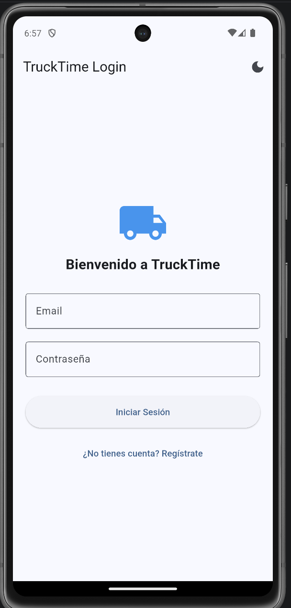
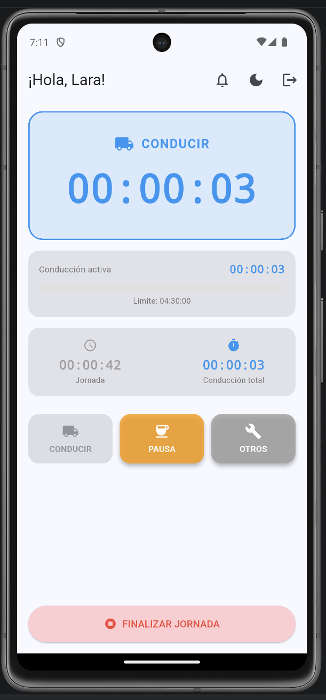
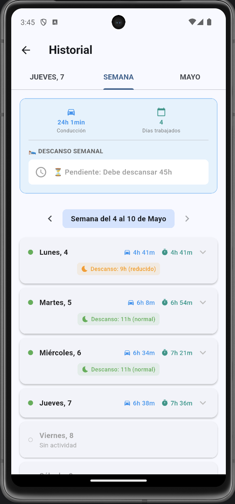

# TruckTime - Gestión de Tiempo para Camioneros

Aplicación móvil desarrollada como Proyecto Final del Grado Superior en Desarrollo de Aplicaciones Multiplataforma (DAM). Gestiona los tiempos de conducción, descanso y otros trabajos de los camioneros profesionales, cumpliendo con el **Reglamento CE 561/2006**.

## Capturas

### Login


### Pantalla principal - Conducción activa


### Historial semanal


## Funcionalidades

- **Control de jornada**: Abrir y cerrar jornadas de trabajo con registro automático.
- **Temporizadores en tiempo real**: Conducción activa, descanso y otros trabajos con cronómetro preciso.
- **Alertas de conducción**: Notificaciones a las 4h, 4h15min y 4h30min de conducción continua.
- **Gestión de descansos**: Pausas fraccionadas (15+30 min), descansos de 45 min y descansos semanales.
- **Descansos reducidos**: Control de hasta 3 descansos reducidos (9h en vez de 11h) por semana.
- **Historial de jornadas**: Consulta de jornadas anteriores y resumen de conducción semanal/mensual.
- **Sistema de notificaciones**: Alertas en tiempo real y bandeja de notificaciones interna.
- **Modo oscuro/claro**: Tema personalizable con persistencia local.

## Tecnologías

- **Flutter** / **Dart** (SDK ^3.11.3)
- **http** - Comunicación REST con el backend
- **shared_preferences** - Almacenamiento local de preferencias
- **flutter_local_notifications** - Notificaciones push locales

## Backend

La app se conecta a una API REST desarrollada en **PHP** con **Slim Framework**:

- Repositorio backend: [trucktime](https://github.com/larabc8-lgtm/trucktime)
- Endpoints: `/usuarios/*`, `/jornadas/*`, `/registros/*`, `/alertas/*`, `/descanso-semanal/*`

## Estructura del proyecto

```
lib/
├── main.dart                     # Punto de entrada, configuración de temas
├── screens/
│   ├── splash_screen.dart        # Pantalla de inicio
│   ├── login_screen.dart         # Inicio de sesión
│   ├── register_screen.dart      # Registro de usuario
│   ├── home_screen.dart          # Panel principal con temporizadores
│   ├── historial_screen.dart     # Historial de jornadas
│   ├── notificaciones_screen.dart # Bandeja de alertas
│   └── descanso_semanal_widget.dart # Gestión de descanso semanal
└── services/
    ├── api_service.dart          # Comunicación con el backend
    ├── session_service.dart      # Gestión de sesión de usuario
    ├── notificacion_service.dart # Servicio de notificaciones locales
    └── notificacion_storage_service.dart # Almacenamiento de notificaciones
```

## Ejecutar

```bash
flutter pub get
flutter run
```

## Reglamento CE 561/2006

La aplicación implementa las siguientes reglas:

| Regla | Descripción |
|-------|-------------|
| 4h30 conducción | Máximo de conducción continua antes de una pausa obligatoria |
| Pausa 45 min | Descanso mínimo de 45 minutos tras 4h30 de conducción |
| Pausa fraccionada | Alternativa: 15 min + 30 min (separados por ≤4h30 de conducción) |
| 9h descanso diario | Mínimo de descanso diario (reducido desde 11h, máx. 3 veces/semana) |
| 11h descanso diario | Descanso diario estándar |
| 56h descanso semanal | Mínimo de descanso semanal ininterrumpido |
| 90h mensual | Máximo de conducción en período de 2 semanas |
